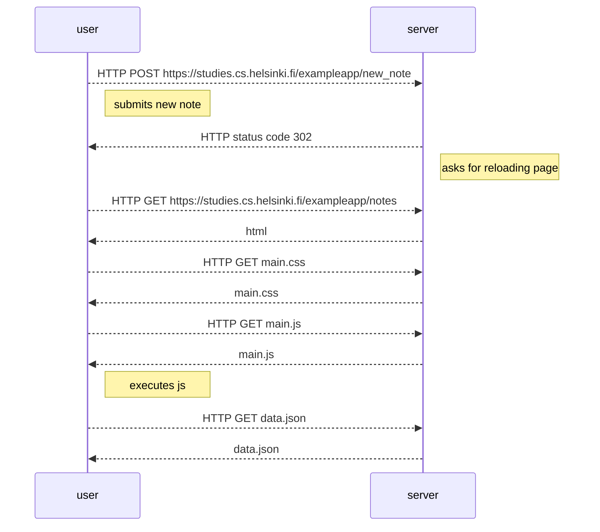

```mermaid
  sequenceDiagram
      participant user
      participant  server
  
      user-->>server: HTTP POST https://studies.cs.helsinki.fi/exampleapp/new_note
      Note right of user: submits new note
      server-->>user: HTTP status code 302
      Note right of server: asks for reloading page

      user-->>server: HTTP GET https://studies.cs.helsinki.fi/exampleapp/notes
      server-->>user: html
      user-->>server: HTTP GET main.css
      server-->>user: main.css
      user-->>server: HTTP GET main.js
      server-->>user: main.js
      Note right of user: executes js 
      user-->>server: HTTP GET data.json
      server-->>user: data.json


```
