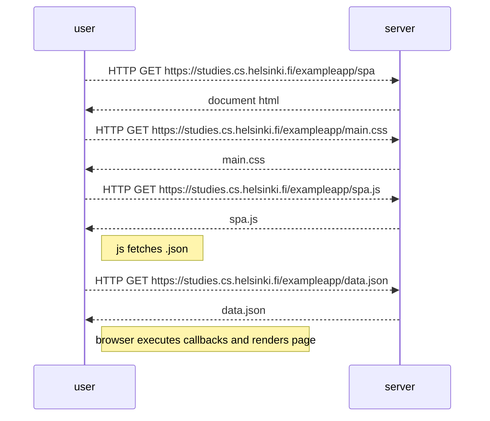

```mermaid
  sequenceDiagram
      participant user
      participant  server
  
      user-->>server: HTTP GET https://studies.cs.helsinki.fi/exampleapp/spa
      server-->>user: document html
      user-->>server: HTTP GET https://studies.cs.helsinki.fi/exampleapp/main.css
      server-->>user: main.css
      user-->>server: HTTP GET https://studies.cs.helsinki.fi/exampleapp/spa.js
      server-->>user: spa.js
      Note right of user: js fetches .json
      user-->>server: HTTP GET https://studies.cs.helsinki.fi/exampleapp/data.json
      server-->>user: data.json
      Note right of user: browser executes callbacks and renders page
 
```
